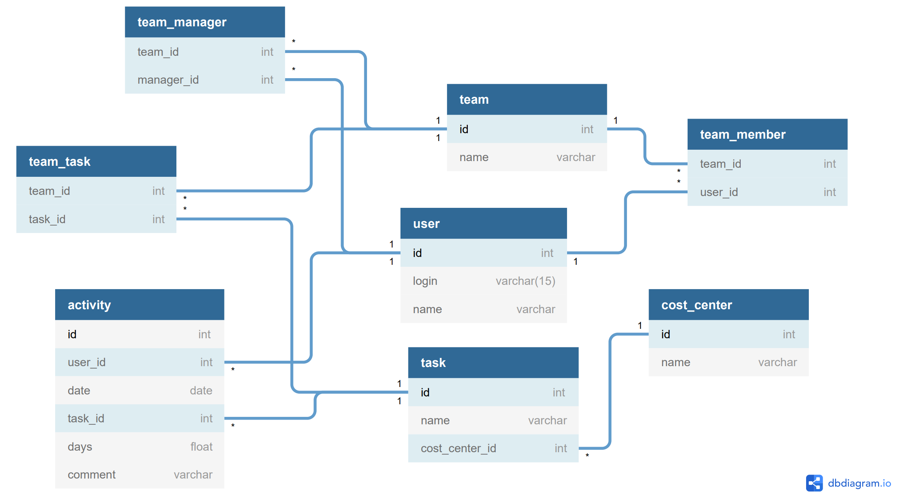

# Timesheets

Sample Timesheets application built with .NET Core, F#, Fable, Feliz, Bulma, Font Awesome.


# SAFE Template
This template can be used to generate a full-stack web application using the [SAFE Stack](https://safe-stack.github.io/). It was created using the dotnet [SAFE Template](https://safe-stack.github.io/docs/template-overview/). If you want to learn more about the template why not start with the [quick start](https://safe-stack.github.io/docs/quickstart/) guide?

## Install pre-requisites
You'll need to install the following pre-requisites in order to build SAFE applications

* The [.NET Core SDK](https://www.microsoft.com/net/download) 3.1 or higher.
* [npm](https://nodejs.org/en/download/) package manager.
* [Node LTS](https://nodejs.org/en/download/).

## Starting the application
Start the server:
```bash
cd src\Server\
dotnet run
```

Start the client:
```bash
npm install
npm run start
```

Open a browser to `http://localhost:8080` to view the site.

## SAFE Stack Documentation
If you want to know more about the full Azure Stack and all of its components (including Azure) visit the official [SAFE documentation](https://safe-stack.github.io/docs/).

You will find more documentation about the used F# components at the following places:

* [Saturn](https://saturnframework.org/docs/)
* [Fable](https://fable.io/docs/)
* [Elmish](https://elmish.github.io/elmish/)

## Learning resources

Learning resources I used to build this application:

* F# language, in particular [F# for fun & profit](https://fsharpforfunandprofit.com/).
* [The Elmish Book](https://zaid-ajaj.github.io/the-elmish-book/#/).

## Use cases

* Data model: 

Also includes:

* French public holidays

## Features

* Page navigation with [Feliz.Router](https://github.com/Zaid-Ajaj/Feliz.Router) (inspired from [Routing And Navigation](https://zaid-ajaj.github.io/the-elmish-book/#/chapters/scaling/routing) chapter).
* [SQLite](https://www.sqlite.org/index.html) database using [F# Dapper](https://github.com/AlexTroshkin/fsharp-dapper).
* [Bulma](https://bulma.io/) CSS and [Font Awesome](https://fontawesome.com/) icons.
* [Expecto](https://github.com/haf/expecto) unit tests.

## Design

* Domain constrained types (`SafeDate`, `Week`, etc.)
* Constrained types also used in DTO with type handlers.

## Troubleshooting

* Need to round date intervals because Javascript date intervals are impacted by daylight saving time.

## ToDo
### Domain

* Ensure a user always belong to a team.
* Ensure consistent Activity work days for months (no activity should overlap between two months).

### Technical

* Add UI tests with canopy.
* Use [Fable.Mocha](https://github.com/Zaid-Ajaj/Fable.Mocha) unit tests for Javascript.
